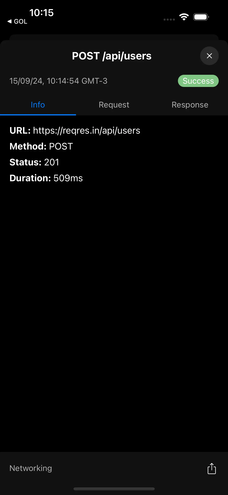

<p align="center">
  
</p>

<h1 align="center">
  React Native Beagle
</h1>

<p align="center" style="font-weight: bold;">
Sniff Out Bugs with Your Trusty, Zero-Dependency Companion
</p>

<div align="center">

[](https://github.com/ailtonvivaz/react-native-beagle/actions)
[](https://www.npmjs.com/package/react-native-beagle?activeTab=dependencies)
[](https://www.npmjs.com/package/react-native-beagle)
[](https://bundlephobia.com/result?p=react-native-beagle)
[](https://www.npmjs.com/package/react-native-beagle)
[](./LICENSE)

React Native Beagle is your trusty debugging companion, helping you sniff out bugs and performance issues in your React Native applications. Like a keen-nosed Beagle on the trail, it tracks network requests, logs custom data, and provides a user-friendly interface for inspecting your app's inner workings during development and testing. Unleash the power of Beagle and pawsitively improve your debugging workflow!

</div>

## Screenshots

<div align="center">
  
  
  
  
  
</div>

## Features

- **Automatic Network Logging:** Automatically logs all network requests and responses, including headers, body, and timing information.
- **Customizable Plugins:** Create your own plugins to log custom data, such as analytics events, feature flags, or storage operations.
- **Customizable Log Detail Pages:** Design custom detail pages for different log types to display relevant information in a structured way.
- **Built-in Log Types:** Provides built-in log types for common use cases, such as messages and errors.
- **Export Logs:** Export logs as JSON.
- **Themeable UI:** Choose from light and dark themes to match your app's design.
- **Clipboard Integration:** Easily copy log details to the clipboard for sharing or further analysis.

## Installation

```bash
npm install react-native-beagle
```

## Usage

### Basic Setup

#### 1. Wrap your app with the `BeagleProvider` component:

```tsx
import { BeagleProvider } from 'react-native-beagle';

export default function App() {
  return (
    <BeagleProvider>
      {/* Your app components */}
    </BeagleProvider>
  );
}
```

#### 2. (Optional) Add a way to open the inspector
By default, Beagle does not open automatically. You can add a button or use a gesture (like shaking the device) to trigger it manually.

Here's an example using the useBeagle hook and a button:
```tsx
import { useBeagle } from 'react-native-beagle';

function MyComponent() {
  const { openInspector } = useBeagle();

  return (
    <Button onPress={openInspector}>Open Beagle Inspector</Button>
  );
}
```

#### 3. (Optional) Log messages and errors using the `Beagle` API:

```tsx
import { Beagle, ErrorLog, MessageLog } from 'react-native-beagle';

Beagle.log(new MessageLog('App loaded', 'info'));

try {
  // Some code that might throw an error
} catch (error) {
  Beagle.log(new ErrorLog('Something went wrong', error));
}
```

### Creating Custom Plugins

#### 1. Create a class that extends `BeagleLogPlugin`:

```tsx
import { BeagleLogPlugin, BeagleLog, DetailContent } from 'react-native-beagle';

export class AnalyticsLogPlugin extends BeagleLogPlugin<AnalyticsLog> {
  name: string = 'Analytics';

  canHandle(log: BeagleLog): log is AnalyticsLog {
    return log instanceof AnalyticsLog;
  }

  provideDetailContent(log: AnalyticsLog): DetailContent {
    return {
      key: 'analytics',
      kind: 'list',
      children: [
        {
          kind: 'label',
          label: 'Event',
          value: log.event,
        },
        { kind: 'text', text: 'Parameters', variant: 'body', bold: true },
        {
          kind: 'json',
          data: log.params,
        },
      ],
    };
  }
}
```

#### 2. Register the plugin with Beagle:

```tsx
import { Beagle } from 'react-native-beagle';
import { AnalyticsLogPlugin } from './plugins/Analytics/AnalyticsLogPlugin';

Beagle.registerPlugin(new AnalyticsLogPlugin());
```

## Content Types

Beagle uses a flexible content system to display log details. You can use the following content types to build rich and informative detail pages:

- `text`: Displays text with optional formatting (variant, bold, selectable, lines).
- `json`: Displays JSON data in a collapsible tree view.
- `label`: Displays a label and value pair.
- `loading`: Displays a loading indicator.
- `section`: Groups content under a collapsible section header.
- `box`: Arranges content in a horizontal or vertical box layout.
- `list`: Displays a list of content items.
- `tab-bar`: Displays a tab bar with multiple tabs, each containing a list of content items.

## Example

See the `example` directory for a complete example of how to use Beagle in a React Native app.

## Roadmap

- **Improved Filtering and Search:** Add more advanced filtering and search options, such as filtering by date range or regular expressions.
- **Advanced Export Options:** Add support for exporting logs in different formats, such as HAR and custom structure.
- **Remote Logging:** Add support for sending logs to a remote server for centralized analysis.

## Contributing

Contributions are welcome! Please see the [contributing guidelines](CONTRIBUTING.md) for more information.

## License

MIT